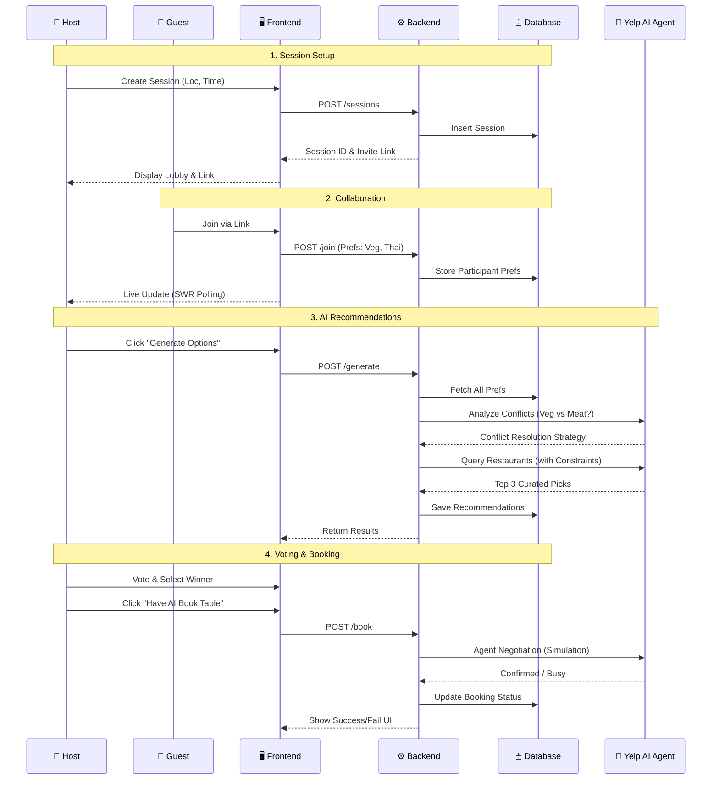

# 🍽️ Social Dining


**Stop arguing, start eating.**

Social Dining is a collaborative social dining app that helps groups decide where to eat using AI-powered recommendations from the Yelp AI API. Create a session, invite friends, set preferences, and let AI find the perfect restaurant for everyone!

---

## ✨ Features

- **🎯 Group Sessions** - Create dining sessions and invite up to 10 friends
- **🤖 AI-Powered Recommendations** - Get personalized restaurant suggestions using Yelp AI
- **🍕 Preference Aggregation** - Combine everyone's dietary restrictions, cuisine preferences, and vibes
- **👍 Voting System** - Vote on recommendations to find the group's top choice
- **⏰ Real-time Updates** - See participants join and recommendations appear live
- **🔗 Easy Sharing** - Share session links to invite friends

---

## 🏗️ Architecture Flow

The following sequence diagram illustrates how **Social Dining** orchestrates the user journey from session creation to AI-driven booking.



---

## 🚀 Tech Stack

| Layer | Technology |
|-------|------------|
| **Frontend** | Next.js 14, React, Tailwind CSS, SWR |
| **Backend** | FastAPI, Python 3.8+ |
| **Database** | Supabase (PostgreSQL) with Row Level Security |
| **AI** | Yelp AI API |

---

## 📁 Project Structure

```
social-dining/
├── frontend/                # Next.js frontend application
│   ├── src/
│   │   ├── app/            # Next.js app router pages
│   │   ├── components/     # React components
│   │   └── hooks/          # Custom React hooks (useSession, etc.)
│   └── package.json
│
├── backend/                 # FastAPI backend service
│   ├── main.py             # API endpoints
│   ├── ai_service.py       # Yelp AI integration
│   ├── yelp_mapper.py      # Response parsing
│   ├── models.py           # Pydantic models
│   ├── database.py         # Supabase client
│   ├── db_scripts/         # Database schema
│   │   └── consolidated_schema.sql
│   └── requirements.txt
│
├── design/                  # Design assets
├── requirements.md          # Project requirements
├── system_design.md         # Architecture documentation
└── README.md
```

---

## 🛠️ Prerequisites

- **Node.js** 18+ & npm
- **Python** 3.8+
- **Supabase Account** - [Sign up free](https://supabase.com/)
- **Yelp API Key** - [Get API access](https://www.yelp.com/developers)

---

## 🗄️ Database Setup (Supabase)

1. **Create a Project** on [Supabase](https://supabase.com/)

2. **Run the Schema**:
   - Go to **SQL Editor** in your Supabase Dashboard
   - Copy contents of `backend/db_scripts/consolidated_schema.sql`
   - Paste and run to create all tables

3. **Get Credentials**:
   - Go to **Settings > API**
   - Copy `Project URL` and `anon/public` key

---

## ⚙️ Environment Variables

### Backend (`backend/.env`)
```env
SUPABASE_URL=https://your-project.supabase.co
SUPABASE_KEY=your-anon-key
YELP_API_KEY=your-yelp-api-key
YELP_AI_ENDPOINT=https://api.yelp.com/ai/chat/v2
```

### Frontend (`frontend/.env.local`)
```env
NEXT_PUBLIC_API_URL=http://localhost:8000
```

---

## 🏃‍♂️ Running Locally

### Backend
```bash
cd backend

# Create virtual environment
python -m venv venv

# Activate (Windows)
.\venv\Scripts\activate

# Activate (macOS/Linux)
source venv/bin/activate

# Install dependencies
pip install -r requirements.txt

# Run server
uvicorn main:app --reload --port 8000
```

### Frontend
```bash
cd frontend

# Install dependencies
npm install

# Run development server
npm run dev
```

Open [http://localhost:3000](http://localhost:3000) to start the app!

---

## 🔌 API Endpoints

| Method | Endpoint | Description |
|--------|----------|-------------|
| `POST` | `/sessions` | Create a new dining session |
| `GET` | `/sessions/{id}` | Get session details, participants, recommendations |
| `POST` | `/sessions/{id}/join` | Join a session with preferences |
| `POST` | `/sessions/{id}/generate` | Generate AI recommendations |
| `POST` | `/sessions/{id}/vote` | Cast a vote on a recommendation |

---

## 🧪 Testing the Flow

1. **Create Session**: Host creates a session with location
2. **Share Link**: Copy invite link and share with friends
3. **Join & Set Preferences**: Each participant joins and sets:
   - Dietary restrictions (vegetarian, gluten-free, etc.)
   - Cuisine preferences (Italian, Japanese, etc.)
   - Budget tier ($, $$, $$$)
   - Vibe (casual, romantic, business, etc.)
4. **Generate Recommendations**: Host triggers AI to find restaurants
5. **Vote**: Everyone votes on their favorites
6. **Decide**: Top-voted restaurant wins!

---

## 📝 Database Schema

The database consists of 4 main tables:

- **sessions** - Dining session metadata
- **participants** - Users in each session with preferences
- **recommendations** - AI-generated restaurant suggestions
- **votes** - User votes on recommendations

See `backend/db_scripts/consolidated_schema.sql` for full schema.

---

## 🤝 Contributing

1. Fork the repository
2. Create a feature branch (`git checkout -b feature/amazing-feature`)
3. Commit changes (`git commit -m 'Add amazing feature'`)
4. Push to branch (`git push origin feature/amazing-feature`)
5. Open a Pull Request

---

## 📄 License

This project is built for the Yelp AI Hackathon.

---

**Made with ❤️ for people who love food and hate restaurant debates.**
