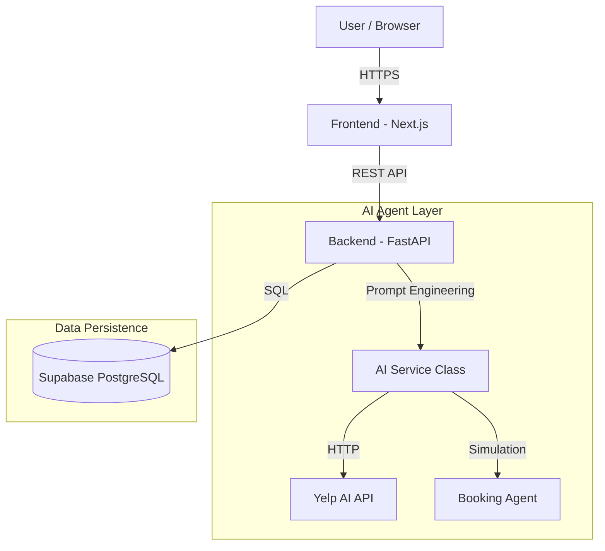
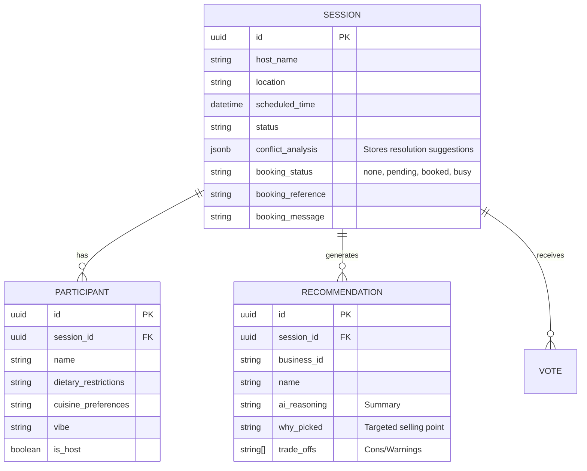

# System Design: Social Dining (AI-Enhanced) 🤖🍽️

## 1. Executive Summary
**Social Dining** is an AI-powered social dining app that solves the "where should we eat?" coordination problem. It goes beyond simple search by acting as an **intelligent mediator**:
1.  **Conflict Resolver**: Analyzes group preferences to detect clashes (e.g., "Steakhouse" host vs "Vegan" guest) and suggests compromises.
2.  **Curated Recommendations**: Uses Yelp AI to pick the top 3 spots with "Why Picked" reasoning.
3.  **Reservation Agent**: Simulates an AI agent calling the restaurant to book a table for the winner.

---

## 2. System Architecture

### High-Level Architecture
The system uses a **Client-Server** model enhanced with an **AI Agent Layer**.

### Key Components
*   **Frontend**: Next.js 14 (App Router) + Tailwind CSS.
*   **Backend**: FastAPI (Python) for high-performance async API.
*   **Database**: Supabase (PostgreSQL) for relational data and real-time potential.
*   **AI Engine**: Yelp AI API for semantic search + Custom logic for conflict resolution.

---

## 3. Database Schema

Updated schema to support Conflict Resolution and Booking Agents.

---

## 4. AI Workflows

### A. Conflict Resolution Agent
*Trigger*: When "Generate Recommendations" is clicked.
1.  **Input**: List of all participant preferences (Diets, Cuisines, Vibes).
2.  **Analysis**:
    *   Checks for hard constraints (Vegan vs Steakhouse).
    *   Checks for soft constraints (Budget mismatches).
3.  **Output**: A structured JSON object.
    *   `has_conflicts`: Boolean.
    *   `resolution`: "Detected a mix of Meat Lovers and Vegans. Prioritizing Asian Fusion places with strong plant-based options."

### B. Reservation Agent (Mock)
*Trigger*: Host clicks "Have AI Book This Table" on the winning card.
1.  **Simulated Negotiation**: Backend sleeps for 2-3 seconds to mimic phone call latency.
2.  **Randomized Outcome**:
    *   **Success (70%)**: Returns a generated Confirmation Code.
    *   **Busy (30%)**: Returns a failure message ("No tables at 7 PM").
3.  **Persistence**: Updates `sessions.booking_status` so all users see the result.

---

## 5. Deployment Plan
*   **Frontend**: Dockerized Next.js on Google Cloud Run (Port 3000).
*   **Backend**: Dockerized FastAPI on Google Cloud Run (Port 8080).
*   **Database**: Managed Supabase instance.
